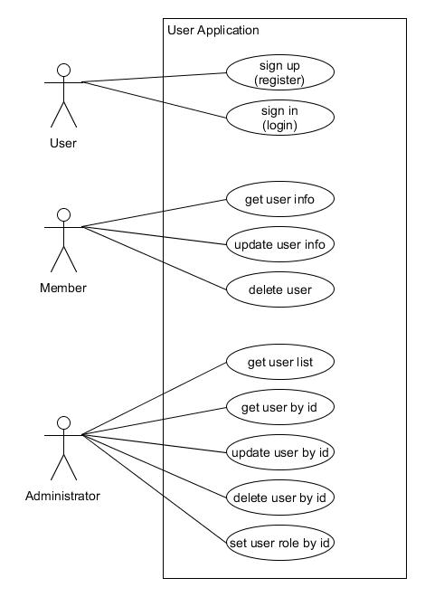

# User Application

## Benutzer
Unsere Applikation kennt drei Arten von Benutzer 

| Benutzerarten||
|-|-|
| User | nicht Authentifziert, nicht Authorisiert | 
| Administrator | Authentifziert, Authorisierung '**admin**' |
| Member | Authentifziert, Authorisierung '**member**' |

## Use Case 'User Application'

# REST Interface
Ein REST Aufruf können sie sich als HTTP-Anfragen an einen bestimmten Pfad (URL) vorstellen. Jede Anfrage wird mit einem bestimmten HTTP-Verb (GET, POST, PUT, PATCH, DELETE) gesendet, so dass die gewünschte Aktion bestimmt werden kann.

Daten werden in REST typischerweise im [JSON-Format](https://www.json.org/json-en.html) transferiert. XML ist auch möglich, mittlerweile aber eher nicht mehr gebräuchlich.

## REST Pfad
Ein REST-Pfad besteht aus einem Grundpfad (z.B. '/api/v1') und einem Anwendungsfallpfad (hier: '/user') welcher die Anwendungsfälle beschreibt.  

Wir werden den Grundpfad für jede Art von Benutzern erweitern, das hilft uns später beim Absichern der REST-Zugriffe.  

Dies führt zu den folgenden Zugriffspfaden:
- **/api/v1/auth** für User
- **/api/v1/admin/users** für Administratoren
- **/api/v1/member/users** für Member

## REST Funktionalität

### User

#### Create a new member.

|Path|Verb|Data|Result|HTTP-Status|
|----|----|----|------|-----|
| **/api/v1/auth/signup** | POST | firstName  lastName  email*  password* | JWT token | OK  CONFLICT  BAD_REQUEST |

#### Sign in to become a member or admin

|Path|Verb|Data|Result|HTTP-Status|
|----|----|----|------|-----|
| **/api/v1/auth/signin** | POST | email*  password* | JWT token | OK  BAD_REQUEST |

### Member
Der Memberzugriff ist nur möglich, wenn wir authentifiziert und entsprechend authorisiert sind. Member können desshalb nur auf ihre eigenen Daten zugreifen.

#### Get user info
|Path|Verb|Data|Result|HTTP-Status|
|----|----|----|------|-----|
| **/api/v1/member/users** | GET | - |  user | OK |

#### Update user info
|Path|Verb|Data|Result|HTTP-Status|
|----|----|----|------|-----|
| **/api/v1/member/users** | PATCH | firstName  lastName  email  password |  updated user | OK |

#### Delete user
|Path|Verb|Data|Result|HTTP-Status|
|----|----|----|------|-----|
| **/api/v1/member/users** | DELETE | - |  - | OK |

### Administrator
Administratoren können alle Member bearbeiten. Sie müssen desshalb angeben, welcher Member gemeint ist. Member werden mittels ihrer 'id' ausgewählt.

#### Get all users
|Path|Verb|Data|Result|HTTP-Status|
|----|----|----|------|-----|
| **/api/v1/admin/users** | GET | - | List of users | OK |

#### Get single user
|Path|Verb|Data|Result|HTTP-Status|
|----|----|----|------|-----|
| **/api/v1/admin/users/{id}** | GET | - | user | OK  BAD_REQUEST |

#### Update user info
|Path|Verb|Data|Result|HTTP-Status|
|----|----|----|------|-----|
| **/api/v1/admin/users/{id}** | PATCH | firstName  lastName  email  password |  updated user | OK  BAD_REQUEST |

#### Delete user
|Path|Verb|Data|Result|HTTP-Status|
|----|----|----|------|-----|
| **/api/v1/admin/users/{id}** | DELETE | - |  - | OK |

#### Set the users role
|Path|Verb|Data|Result|HTTP-Status|
|----|----|----|------|-----|
| **/api/v1/admin/users/{id}/role** | PUT | role |  updated user | OK  BAD_REQUEST |